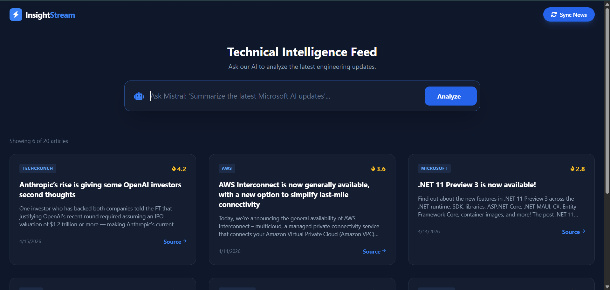
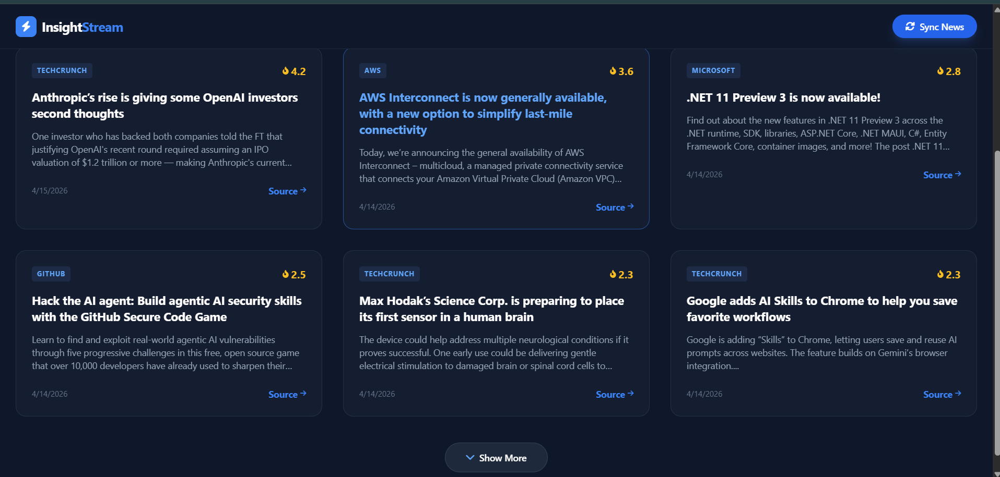
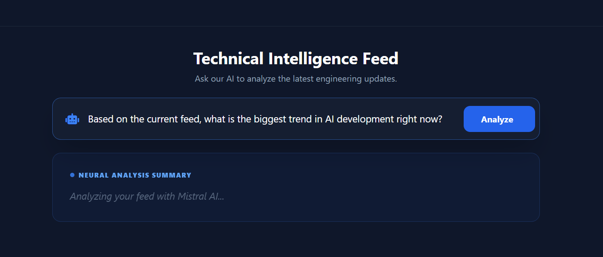
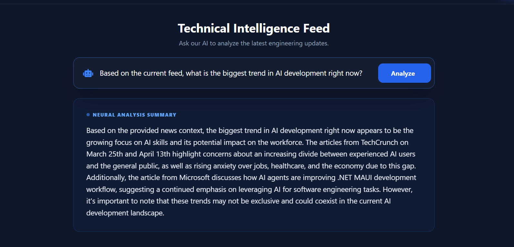

# InsightStream

**Technical Intelligence Platform powered by AI**

InsightStream is an intelligent news aggregation and analysis platform that scrapes the latest technical updates from industry-leading sources and allows you to query them using an AI chatbot. Get real-time insights into AI, cloud computing, open-source developments, and cybersecurity trends.

## Summary

InsightStream combines **web scraping**, **vector embeddings**, and **Groq API-powered LLM inference** to create a powerful tech intelligence tool. It automatically collects articles from top tech sources, eliminates duplicates using semantic similarity, ranks them by impact, and lets you ask natural language questions about the latest developments. Powered by Groq's ultra-fast LLM for intelligent analysis. Perfect for engineers, product managers, and tech enthusiasts who need to stay informed without information overload.

## Features

✨ **Smart News Aggregation**
- Fetches from multiple sources: GitHub Blog, AWS, Microsoft Devblogs, TechCrunch
- Filters articles published within the last 7 days
- Removes duplicate articles using semantic similarity detection
- Calculates impact scores based on keywords and freshness

🤖 **AI-Powered Analysis**
- Query technical news using natural language
- Powered by Groq's fast LLM inference for rapid responses
- Semantic search across all articles using HuggingFace embeddings
- Retrieval Augmented Generation (RAG) for accurate, context-aware responses

🎯 **Intelligent Data Management**
- MongoDB storage for persistent article data
- ChromaDB vector database for fast semantic search
- Automatic cleanup of articles older than 7 days
- Duplicate detection with optimized similarity threshold (0.38)

🎨 **Modern Web Interface**
- Clean, responsive UI built with TailwindCSS
- One-click news synchronization
- Real-time AI analysis interface
- Dark mode design optimized for readability

## Tech Stack

- **Backend:** Flask, Python
- **Data Storage:** MongoDB, ChromaDB, SQLite
- **NLP & AI:** LangChain, Groq API, HuggingFace Embeddings
- **Web Scraping:** feedparser, BeautifulSoup
- **Frontend:** HTML5, TailwindCSS, JavaScript
- **Embeddings Model:** all-MiniLM-L6-v2
- **LLM:** Groq (via LangChain)

## Installation

### Prerequisites
- Python 3.8+
- MongoDB running locally or accessible via URI
- Groq API key (sign up at https://groq.com)
- pip package manager

### Setup Steps

1. **Clone and navigate to project:**
   ```bash
   cd InsightStream
   ```

2. **Create virtual environment:**
   ```bash
   python -m venv venv
   venv\Scripts\Activate.ps1  # Windows PowerShell
   # or
   source venv/bin/activate   # Linux/Mac
   ```

3. **Install dependencies:**
   ```bash
   pip install -r requirements.txt
   ```

4. **Configure environment variables:**
   Create a `.env` file in the project root:
   ```
   MONGO_URI=mongodb://localhost:27017/
   GROQ_API_KEY=your_groq_api_key_here
   ```

5. **Run the application:**
   ```bash
   python app.py
   ```

7. **Access the web interface:**
   Open your browser and navigate to `http://localhost:5000`

## Project Structure

```
InsightStream/
├── app.py                 # Flask application & main logic
├── engine/
6. **Access the web interface:**feed scraper for technical news
│   ├── models.py         # Impact scoring algorithm
│   └── processor.py      # Duplicate detection & vector DB utilities
├── templates/
│   └── index.html        # Web UI template
├── static/
│   ├── style.css         # Custom styling
│   └── main.js           # Frontend interactions
├── chroma_db/            # Vector database storage
├── requirements.txt      # Python dependencies
└── README.md            # This file
```

## How It Works

### 1. **News Ingestion Pipeline**
- Scrapes RSS feeds from technical sources every sync
- Parses and cleans article summaries
- Calculates impact scores based on keywords and recency
- Stores articles in MongoDB with metadata

### 2. **Duplicate Detection**
- Uses semantic similarity to detect duplicate articles
- Threshold of 0.38 balances precision and recall
- Prevents the same story from multiple sources appearing as duplicates

### 3. **Vector Indexing**
- Converts all articles to embeddings using HuggingFace model
- Stores embeddings in ChromaDB for fast semantic search
- Automatically removes embeddings older than 7 days

### 4. **AI Query Processing**
- User submits natural language query
- Retrieves most relevant articles using semantic search
- Ollama Mistral LLM generates context-aware response
- Uses RAG (Retrieval Augmented Generation) pattern

## Usage

1. **Sync Latest News:**
   - Click "Sync News" button in the top navigation
   - Application fetches latest articles from configured sources
   - Articles are processed and indexed automatically

2. **Ask AI Questions:**
   - Type your question in the chat input (e.g., "Summarize the latest Microsoft AI updates")
   - Click "Analyze" or press Enter
   - AI analyzes relevant articles and provides insights

3. **Example Queries:**
   - "What are the latest AI developments?"
   - "Summarize recent cloud computing announcements"
   - "What's new in open-source projects?"
   - "Tell me about the latest security vulnerabilities"

## Impact Scoring Algorithm

Articles are scored 1-10 based on:
- **Keywords:** Higher weights for trending topics (AI: 2.0x, LLM: 2.5x, Cybersecurity: 1.8x, etc.)
- **Freshness:** Score decreases 0.2 points per hour since publication
- **Boundaries:** Normalized to stay within 1.0-10.0 range

## Configuration

### Hot Keywords
Edit `engine/models.py` to adjust impact weights:
```python
HOT_KEYWORDS = {
    "AI": 2.0,
    "LLM": 2.5,
    "Nvidia": 2.0,
    # Add or modify keywords...
}
```

### RSS Feed Sources
Edit `engine/scraper.py` to add/remove sources:
```python
FEEDS = {
    "GitHub": "https://github.blog/feed/",
    "AWS": "https://aws.amazon.com/blogs/aws/feed/",
    # Add more sources...
}
```

### Similarity Threshold
Adjust duplicate detection in `engine/processor.py`:
```python
return results[0][1] < 0.38  # Increase for stricter matching
```

## 📸 Screenshots

## 📸 Screenshots






## Dependencies

See `requirements.txt` for full list. Key packages:
- `flask==3.1.3` - Web framework
- `pymongo==4.x` - MongoDB driver
- `langchain` - LLM orchestration
- `langchain-ollama` - Ollama integration
- `langchain-community` - Community integrations
- `feedparser` - RSS parsing
- `beautifulsoup4` - HTML parsing
- `python-dotenv` - Environment management

## License

MIT License - See LICENSE file for details

Copyright (c) 2026 nishita-502

## Contributing

Contributions are welcome! Feel free to:
- Report bugs and issues
- Suggest new features
- Improve documentation
- Submit pull requests

## Future Enhancements

- [ ] Support for more RSS feed sources
- [ ] User authentication and saved queries
- [ ] Advanced filtering and sorting options
- [ ] Export articles to PDF/CSV
- [ ] Real-time streaming updates
- [ ] Multi-language support
- [ ] Custom LLM model selection
- [ ] Historical trend analysis


